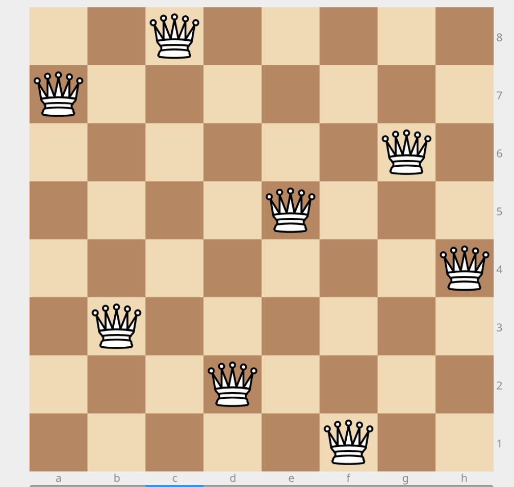

# NQGA

Hello. This is experiment code, a lab for enhancing my own understanding. It
isn't meant to be any sort of production-quality code, but I did want to be
able to show it to some people. If I didn't send you here, you probably don't
want to poke around here.

This is a program for solving the n-Queens problem using genetic algorithms in
Python. The code is one giant pile of hacks right now, as I just wanted to get
it working and check my understanding of the problem. It's object-oriented to
all hell, but it was built in pieces as lectures proceeded to check my
understanding of the various pieces.

**Notes**:

1. An n x n board is represented as a string of n digits. Each digit
   represents a column, with the number being the row that the queen
   has been placed in.
2. The top-level type is the `Experiment`. An `Experiment` contains
   a list of `Generation`s and the latest `Population`.
3. A `Generation` contains a parent `Population`, and once executed,
   a child `Population`. It also tracks things like whether the
   children made progress.
4. A `Population` is basically a wrapper around a number of `Board`s
   with a few methods for convenience.
5. A `Board` contains `Queen`s and some convenience functions.
6. A `Queen` is basically a set of *(x, y)* coordinates and some methods
   for determining if the `Queen` is safe or not.
7. There are no comments.
8. The timer for the default random experiment run uses `process_time`;
   it isn't super accurate, but is really meant to get a ballpark idea
   of run times.

**Example**

Running `nq_ga.py` will run a random 8-queen experiment with a population size of
4. The default output is to print a single character for each generation:

* `<` means the generation regressed (its max fitness is less than its parents)
* `-` means the generation has stagnated (its max fitness is the same as its parents)
* `>` means the generation has improved (its max fitness is greater than its parents)

On my Pixelbook (quad-core Intel Core i5 @ 1.20 GHz), one such run was

```
-bash-4.4$ python nq_ga.py
><><<>--><->><<-><>>><>><-<>--><><>><<><<-<>-<-><>><><-<-<>><><><<>><->><
---<><-<><>><--<-><>><<<><><->--<<><><>>><>---<><<<><><--<<<><><>-<--<<<>
><<><-><><><----><><<>><-->-<><<>-><>><><<><>>-<><><-->--<->-<><>><--><->
-<><->-<<><<><>--<><->---><-<<>-<-><>><<><><-><<><>>><<>-<->-->>-------<>
---<>><<><<><<>-<>><-<>--<-><<>--><>-->><><<><--->>-<-<-->-><<><>->-><><-
-><<--<-<><>-<-->--<>->-><>->-<---<-><><-><<<>-<><><>-<<-<>-<>>>-<>-<<<->
-<><>>-<><->---<><><>><><-->-><-><><><-<>><<-<-><>><-><>-->--<<->-<>->---
-<<-><><>-<--<-->><><--<-><->-<<><><><>-<>-><<>--><-><><>-<>><--<>><>><<-
-<><><<-><-->-->-<><->><><>-<--<><>><><><-----<<><-><->><-><>----><><><><
-<>-<><>-<><>-><-<--<><-><><<><>><<-><<><<>><-<>-<><-><-<-><>-<>--<<>--->
-<->><--><>->-<><>>-><><<>><><><-<>-><<--->><<<->>-><<>><>-<><-><->-><<>-
-<>--<>><-<><>-<><>-<><<>->><-><><->--<----><><>><<-><>>><><<-><--><<->-<
->->-<<><<>-><><<><-<>><<<><-><><>->-<>>-<<>---<>-<><>>-<><--><>>><<><><>
>----><-<>><--><->><-->--<-<>-<->->><-<-><->-<<<>><>-<><><-><><><-<>--><-
<<-><>-<><><>->-<>>><><><<-->><><<><-><-<><>--<><>><<><<>-<><>-<><><><>--
--<--><><-<--->-<><<><<-><-<-><-<->-<<>->><>-<-><><-<<><<>-<><-<>>><<><<>
>-<-<><<>><---><>><-->-<-<>>><>-<<->---<<><><><>-><<-->><>-<><<><>><>><>>
><>---<>>----><<->-<>-<<><<><<><<<->><>->--><>-><>><<<>--<-><><-><><--><>
<<-><>-->><>->--<--<>>->-<-<>->---<>>-<-<<><<>><->-<><><--<><><<->><>>>><
><<><>><><-----<><>>-<<->--<>>-><>-<><>><>><><><<>><><<<-->-<-><><><>-<->
<>->---<-----<>--><>-<><<><--><->-<<><-><><<-<>><->-<>-><->><><>><-><<>><
>><->-<-<->><<->-<>-<>->-<<>->--<<>>>-<>-<>->--<><>--<<--<><<>>--<><><<><
>->--><<>--><>>--<-->-<<><<>>->><<<-><<<>><<><<>--<><><<><>-<<<>--<>-<><>
><>--<<><>->-<-<<>><<>>><<>>-<>><><>-<>--><<><><><><<<><><--><><><>>-<>--
-<--->-<><>><-<<<><<><-><>-<><><><<><><->-<>-<-><<--------><>-><><<<><><<
-<->><><<>><>>-<<>-<><->><-<>-<--<><><<>-><>>-<<><>-<>-<>><-<>->-<--<<>>>
<><-<>-><>-<<>><>-->-<>-><>-<->-><<--><-<-><-><>><>>>--<-<>-><>--<<<>><<<
<><>-<>><><>-<<>>-<>>--<><>-----<->-----><>><>-<><<>>-<>><>-<><-->><<><>>
--<><<--<><->-<<>><<><<><><-><<><>-<>><->--<<-><-><><<>>--<><<><><><>--><
>--><><-<<---><>-><<>-><>>-<>-<-><><---><<><><<<>><-<->>><--->-<><><><<->
-<->-<><--<>->>-<--><>>>-<-<>><<><->-<>----<>><><-<-><>>>><--><><-<>><>>-
<>--><-><<<>-<><-<<>-<-><<><>>>><<><>--><><>>><<>><-<<><-<>><><<-<->-->--
><><---->><><--->->><><><<>-->><<>-<>-<>>-<<><>--<-><<><->>->--<>><<>><>-
<<<><>>>-><-><-><><<><><>><<>><>><<>->-<--><-><<>><>-<><><<><>-><>-<>--><
<---><><-<-<->-><><-<-><><-<>><<-<--<><>><>>--<><><----><<-<<>-<-->----<<
><<<-<><->-<---->--><><------<>-<-><><><>-><>--><-><>>-<-<><<>>><<>><><>-
----<<>><-<>><<>><><>-<><><><><-<->-<><><><>><>->><--><<-<><<><>><>-<><--
>><<<>>--<><<--<><>><>><><>--<>-<<-<--><><-><>><><->>-<>><>><>>><><><-<>-
->--<>-<>><>>>><<-<-<>-->--><<><><>-><><>><-----<><-<-->--->-<><-><><>><<
><>-<-><<>-<<<>>-<-->><<><-<>><-<><----<><->><<>->>>--<>-<>->-<><>->-<>-<
<>-<><>-><>><<><>><->-<><----><><-->-<-><--<><-<<><->--<-><-><<>>--><--<<
>-<><>->-<>>-<><-><>><-><><>-<-<>--->><<>><-<-><><-<><><>-><->-<--<>><->-
<-><><>->><><-->-<-<>-<<----<><>>-<>-><><-><-<>><--<<->-><<->-><<--<<-><-
---<>->-<->-<<><-<<><>->->-<>->-<><<><><-><->>><><<<>--<><--><>><><<>><<-
<-<><><--<<><>-<><><>><><--><>>><><>><-><->>-<>-<<-->-><<><>-<><<>>><>-><
>-<>-<><>--->><<>>--<<><<-><>----><><><<-<>--<--><><><><><-<>>-<->><<><<<
><-<><>-<><-><>-<><-><><><-<-><>><-><>><-><--<-<->-><-<>-><>><-><-><--->-
--<>><><><--><-<<-><>>--<-><><>-->>-<->-<<--><>><><><><>->--<><-<--><-><>
<<>>><<--><>---<><><-<>><><><>><<<<>->-><><>->-<-<><><->><-<>-<>-<-<<<>->
<<<>>><-<>--<->>-<---<<>-<-<>><<-><<>->-<><-<>><--><<><<>>>><<-><><>><<->
<><><><<<>-->-<<-><>><><><>--<><><<--<<>>-><->-<--->-<><><-<>>-->-<>><>--
--<<><><><->-<><><--<-><>-<-<>>---<><><-->-<>>>><--->-<<<-<>><->-<--><><>
><<>>--<>><->><<>>><>><><>-<-<>>--<>->-<->-<>--<--><><><<><--->><><->><<>
-<-><>>-<><-><-><<><><><<<<>->-<->><><><<>->>-><<><---<><<>-><-><-<>>>-<>
--<---><-><><><-<>--<><-><><>-<><<-<->-><-<>>><>>--<><><>->-<><-><><<<---
>>><><>--<>-<>><<><>->>--><<<->><><><->-><<><><<>><<><--><><><>>->><--<>>
><<-><>>-><><-><><>---<<>>-<>><--<>><<<<>-<>>><>-<<>-<><><><<<>->><<><>><
><><><>><----<-><<>-<>>><->><<->>--<>--<<<<>-><>-<><><>-<>-><<<-->-<><<--
>-<>-<>--><>-<<<->--<-<>><>--<>-<><<>->><->><<<>><>><-><<->-<<--><<>><><>
<-<<><<>>><><-><>-->><<<->><--<><-<>-<<>>-><>--<------<<>>--><><>->--<-<>
><><---><>-<><<><>>-<<>><<>->--<<>><-><>><-<><>----<>-<->>-<><>-<>><---<>
<>>->-<<->><><----->-><><><>-<<>-<-<<><>-><><><>->-<><><><<>>--<>--><>>-<
<><>><>>><>>>-<<><>><<><<-<><><<>>--><---><>><><<>->>-<<>><>><<>><-><><-<
><>--<>--<><<>-<><>>-><<<><><><--><->-><<><>>><--<--><->----><>->-<><-->>
<>-<-><-<>-<><<>--<->-<><>--<--<>>-<><--><-<<><>>--<->-><<-><->><><<><>->
<<>->><>--<<-><<<><--><-<>>><--->-<--<>-<>--<><<><->--<>>-<><><>><-><-<><
-<>><-<><<>--<>-><<><><-->><-><><<<><>><>-><-><-<<>-<-<>-<><--<><<><<><><
>>><><>><->-><><<><>><><<<>><>><>><>-<><><->-<><>-<><--<<>--><<><-<>-><<<
<>><-<>><<-<><><--->-><>--><<-<-<>><><>><>------<><<>>>-<<>--<><>><>--><-
-<>--<>-<><<><>>-<->><>>>-<<>>->--<--<>>>>><><>><<>--><>->-<->-<<><-->-><
--<<-><->--<->><<><><>>><><-><<><--><>--<--><-><-><--->-<<><>-><<>-><<><-
><>-<><<><---><<><->><->->><<>--><<--<>><>>><<>---><>>-<>><<<><><><-->---
-><-<><<-><><-><>>--<>-><><<>-<--->>-<>>--<>><>--<<>--><--<<>><>--->---<>
<>->><---<>>><><-<>-<-<->><><>-<-->->->-<>---<><<><>->->-><-<--<->>><->->
<--><><<<->--<<>>-><>><><<<><<<>>><<>>><<-><><->>-><-->-----<>-<-><<>-<><
><-<>-<-<>><><>>->-<<-><>>-<>-><--<>-><<>-><>><<>><-><><><<>>><-><>--->><
><><-<-><><-<-->-<>>><>-><-<><><<<><><><><<-><>>--<<><>><>----->----<-<>-
<><<->><<><><><---<><><><-<>><<><->-<>>>-<><<>--<-->-<<-><>><><>><<->-><<
<>><>><----><><>>><><><--<<>>>><-><><<->>-----><<>>-><<<>--><>-><-><><---
<><><>><><><>>-<->-<-->->-<><>--<<>--><->-<>>>><><>><><--<>--<>>-><->->><
<>><<>><><>-<>-><><>-<>-<>--><><<><<->-<><><><><<-><<->-><<>><>--<><-><<>
-<<><<><><><-<->->----><->-><>----<<>>-<><>><<-><-><<>>--<>->--<<>><--><>
>-><--<<->---<<<><--><><--><><-><>-<-><-<>><><><->>--<>>--<-<->>><>-<<-><
><>-><-<->><-<>><<>-><>>-<-><>><->><<--><->><<>><->-<>><><>----<><<>><---
>><<><>--><-------<<>->-<-<>><<<>>--<>------<>><<><><-<<>>><--<--><><>->-
--<><><--<><>><>><>-->-<<>>-<<><->-<><<><-><---<><-><-><<-><<>><>-><>><><
->-<><<><><><--><<>>><<>>><>--><-<><><><><--<>--><><<--<->>->--<><<<>><>>
<<--->><-<><-->-<>-<>-<-><><<<<-><>>-<-<->-<<>-<><-<><>>-><<--><><<>>--<>
-<--><-->---<-><>-<--<<->><>>--<>>-<>>>-<<><-<>-->-->-><<><<>><-----<>>-<
>><><>->><>-><<<<-><>-><>><-<>---><<-><->-<><->---<-<><>><<><><-><<><-<--
>->><-><-->><><--<->><<><<>--<<-<><--<--->--<><>->--><-><->--<>--><>---->
<--<-<<><-<>><<->-->--<-<>>-<>>-<>><><<-><<>>><><>>->--><><<-><>--><-><><
<>><>><<>--<-><<>><<>-<<-><->><<--<>-><><>><>->><>-<<--><><><<>>><><><>>>
<-->--<--<>-><>-><><--><<>><><><><<>-><->-<->-<><-<>><><>><-<>><><><>-<>>
><>-<-><>>><<--><><>>-<>><>>--<---><--<<><->-<-<><<>><><<><>-->><><-<<><-
<-><->>-<><><><><<<>-><><><><>-----<-<><>><><><<><----><><><>><-<>><--><-
<>-><<><><>->>--<<><<>--<>--->--><--<<->--<>><-<<>>--<><><><-<-><>><<><<>
>-<><><><<>>-<--<--->-->-<-><><<>>><>-<><>>>-<-<><>><<><<><><>-<<->><>---
<><><<<>-<>><>>><->-><<><<-><><->>--<>--<><><><-<><-<>><><<>><><<><>-<>->
<-><<>><><>>--<>>-<><>-<>>><>><>-<><<><>-<--<>-><<>><->-----><-<><>>-<>-<
><>--<>><>--><<><-><>><<>>><><>><<>><---><-><<>><<-<>><>>><<>-<-->->-<--<
>>---<<>>-<<<><<>--<><><><>-<<>-<->-<<>->--<--->-<<->---<<>><><><>-<><-><
<><<>><><-<><>---<>><><><<>->-<><>->-<->-><<>-<><><>>>-<<>--<><<>>-<-><<>
<><>-><<><<<->>><>-><<><><--<>><><>-<><<><-><>><--><>-<<<><>->><->-<-<-->
<<><>-<>--><<-<<<>->><>-<-<><>>-<---<><--><><>-><<>><<><><><><->><>><>><<
->-----><>>--<><-->-<--<--<>----><>-<-<><<><><><><><<>-><>-<->>><-<->-<--
-><<-<>>>><>><><<>-<<>><<-<><<><>><><---<>-<><>-><>><<->--<>>-<><<>-><><>
>><-><>><>-<-<>><<><----><>--<>><>-<-><>><><->><><>>-->><----<><><>><-<->
<<>--<>><><-><>><>><<><>><->-<--<><>-<-><>><-->><>>->-<-<<>-->--><->-<->>
<-<>><-<<>-<>>-<-<<->>---><-<-><><><>><<-->-<><><<<>><->><<>-><<><><-->><
>-<><>---><>><><>>-<--<---><><<>>><><>>-><->>--><>---<->-<<>>----<>>><<><
><<-><-->-<---<><<>>->->><<<><>-><--><>><><>-><<<><>-<<><>>-<-<-><>---<->
<>><<-><><<>------>><-<<-<>>-><>-<><>->><><><<->><--<->-<-><>----><>-<><>
-><><><>>-<>><><<><><<-<-><><<><<><><-><-<><><><>>-<--><<>><-<<>><--<><--
-<<-><-<><><>-<>>><>><<--><><<><<><><-><--<>><>>-<><-><>><>-<><><<>->><<-
-<<-><-<-><-<>-><><<><>-><->-<><<>>-<<>>---><><---<>><>->---<>>-<><>>-<<>
<>-<><<->-<->><>><><>-<-<--<><<>-><-><>>><<-<>--><->-<<>><-<>---><><>--<<
><>-<->-<<><><-><><><>><<><><>><><<>-<-><<>--><-<->-<-<><><-<><--<>>->-<<
>-><>><<><-<<->>--<>><>-<--><>--<><><><><><><<><->-<<>><<-><><-><-><><<-<
>><>-><<>--<>--<><>-><>-<>><-><<>---<----<--><><-<>><<><><><<<--<<<>--->-
---<<>>--->-<><<>>-<><><--->><<->-<-><->><>----<<>-><-->--><-><><-<<>>-<>
<><<><-><>>-<><>><-><><>--<><><>--<->-<<>>-<>>><><>-<><>>----<>><-><><-><
><-<>>-<>>-<->-><>-><--<><--><>>><>--<->-<>><><>><---><><--><><<>>><->-<-
---<<>-><>>>-<<><><><<>><>><><<->>-><<><-->->>-----><-><>><>><>>><>>-<><>
<<-<><><<-><-<-><><>---<-<><><-<><>><>-<<>-->><-<>><<>><><>><><-<->><<-->
->-><-<><-<>><><-<><><>->>-<>-<-><><>-<---<<>>-<<>><-<-><<><><----><><><>
-><><-><><-><><><><><<-><><>><><-<>><><-<-><>>--<>--><><>--->---<-<>---<>
--<->><>--<><>><><-----<->-<<><>->><<<><-><><->-<<<>><<><<><<>>->><><><--
><><<><<-->->->-<>-<>-<<>><>><><<><-<<><<>><<><><<-><>><><><-<-><-<><>---
<>-<-><-<><->-<>>><-><<>><<>---<->>-->-<><>->-<<>--<-><><--<<<><>-<>>-><<
><><><--<><>><->--<>-<>>><<---><><-><<>->-<>>---><---<---<<>>--<><><--<><
<><<><<<->-><<>><<<>->><<---<><-><>-<>-><<><><-><><-<<><<>-><<<>><-->-<><
><>>-<-><->--<>--<<>>>-<->><<<>>--<<><>-><><--->-><-><<>><-><<-<><><-><-<
><><-><<><>><--<<><<>>>><<>>->-<--><><>-<><>><->-><---<>>-<>-<>-<-->><<><
<-<>><><>>><<><><>-<-><>-<<><-><<->><>-->><<--<><->>><-->><-<>><>>-<><->-
<>><>>-><<><>><<<><>--<>-><<-->>-<>-<><<----><><><<><><->-><-<><--<>-><>>
<<><>-<<><>><>>-<<>>-<--<>>-<<>><><-------->-<>>->
Solution: 73825164 in 9978 generations.
Elapsed: 0:00:08.623379
```

The resulting board looks like



(made with the handy [lichess board editor](https://lichess.org/editor/))

This is mostly for my own personal curiosity, but some other runs included

|  Machine  | Generation count | Elapsed time (s) |
| --------- | ---------------- | ---------------- |
| pixelbook |     32852        | 34.5             |
| pixelbook |     29953        | 34.0             |
| pixelbook |     57978        | 55.8             |
| pixelbook |     29702        | 25.0             |
| pixelbook |     8296         | 7.2              |
| pixelbook |     44948        | 41.8             |
| tx2       |     95085        | 130              |
| tx2       |     48451        | 64.0             |
| tx2       |     10355        | 13.5             |
| tx2       |     19325        | 25.8             |
| tx2       |     7802         | 10.2             |
| tx2       |     41660        | 56.2             |
| tx2       |     42053        | 56.1             |
| tx2       |     415          | 0.5              |
| tx2       |     5330         | 6.2              |
| tx2       |     8208         | 10.3             |
| tx2       |     47719        | 63.2             |
| tx2       |     16800        | 21.1             |
| tx2       |     119820       | 158.4            |

Given the randomness involved, it's no surprise that elapsed time can vary
wildly.

Machines:
* pixelbook (quad-core i5-7Y57 @ 1.20 GHz)
* tx2 (ARMv8 Processor rev 3 (v8l) @ 2.0 GHz)

I do have plans to clean up the code and make something of it, but you may
recall that old adage about the best laid plans.

License: public domain